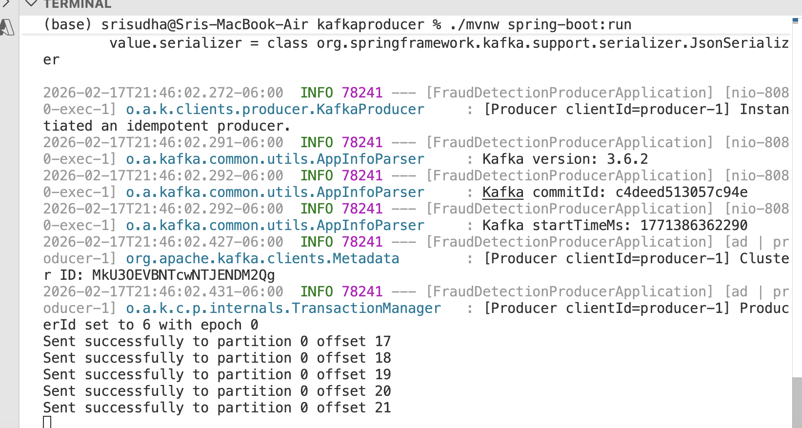
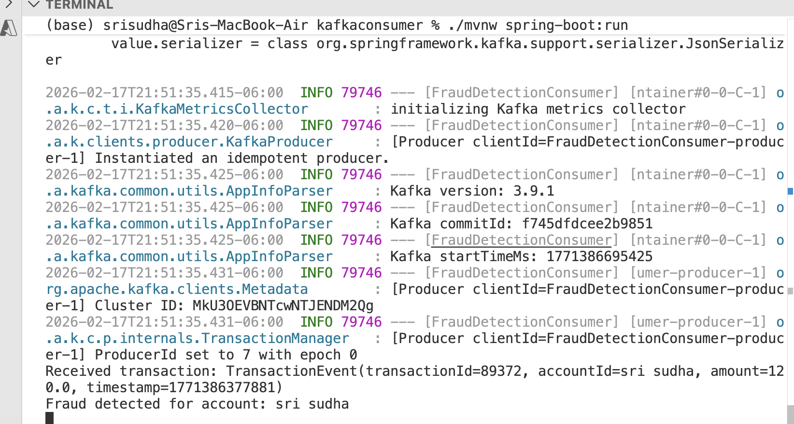

# Fraud Detection on Streaming Data using Kafka

## Overview

This project implements a real-time fraud detection system using Kafka and Redis.

Transactions are streamed into Kafka.
A consumer processes transactions within a time window and detects suspicious activity.
Fraud alerts are published to a separate Kafka topic.

The system demonstrates:

Event-driven architecture

Kafka producer/consumer fundamentals

Manual offset management

Redis-based sliding window detection

Idempotent and configurable processing

## Architecture

Producer → transactions topic → Fraud Consumer → Redis → fraud-alerts topic

Flow

1. Producer publishes transaction events.

2. Consumer reads from transactions.

3. Consumer stores timestamps in Redis (sorted set).

4. If threshold exceeded within time window → fraud detected.

5. Fraud alert is published to fraud-alerts.

## Infrastructure Setup

docker-compose up

### Create topics

kafka-topics --create \
  --topic transactions \
  --bootstrap-server localhost:9092 \
  --partitions 3 \
  --replication-factor 1

kafka-topics --create \
  --topic fraud-alerts \
  --bootstrap-server localhost:9092 \
  --partitions 1 \
  --replication-factor 1

kafka-topics --list --bootstrap-server localhost:9092

kafka-console-producer \
  --topic transactions \
  --bootstrap-server localhost:9092

kafka-console-consumer \
  --topic transactions \
  --from-beginning \
  --bootstrap-server localhost:9092

kafka-topics --bootstrap-server localhost:9092 \
  --delete --topic <topic_name>

### Verify Redis

docker exec -it <redis-container> redis-cli
SET test HELLO
GET test

### Producer Service

At startup:

1. Spring scans classpath

2.Finds spring-kafka

3. Loads KafkaAutoConfiguration

4. Reads application.yml

5. Creates ProducerFactory

6. Creates KafkaTemplate

7. Registers as Bean

8. Injects into service

#### Producer Configuration

spring.kafka.producer:
  retries: 5
  request-timeout-ms: 10000
  delivery-timeout-ms: 30000
  linger-ms: 5
  enable-idempotence: true

retries → number of retry attempts

request.timeout.ms → wait time for broker response

delivery.timeout.ms → total time allowed to deliver record (include retries and delays)

linger.ms → batching delay

enable.idempotence → prevents duplicate writes during retries

#### Producer Send Behavior

When kafkaTemplate.send() is called:

1. Record enters internal buffer (RecordAccumulator)

2. Sender thread batches records

3. Batch is sent when:

    Batch full or linger timeout expires or flush() is called

4. On failure → retries until:

    Success or delivery timeout exceeded

### Consumer Service

Responsibilities

Consume from transactions

Maintain sliding window in Redis

Detect fraud

Publish to fraud-alerts

Manually commit offsets

#### Consumer Configuration

Kafka level - spring.kafka.consumer.enable-auto-commit=false

Spring level - spring.kafka.listener.ack-mode=manual

##### Runtime Flow

1. Spring creates KafkaConsumer

2, Consumer subscribes to transactions

3. Background thread polls Kafka

4. If records exist:

    Spring invokes @KafkaListener

5. After processing:

    ack.acknowledge() is called

6. Spring internally executes:

    consumer.commitSync()

Offsets are committed only after successful processing (commit sync). This ensures atleast once guarantee for the delivery. if we do commitSync() before processing it is atmost once delivery.

### Fraud Detection Logic

Fraud Detection Logic

Redis sorted set per account

Store transaction timestamp as score

Remove entries outside time window

Count number of transactions

If count > threshold → publish fraud alert

Configurable via:

fraud.threshold=3
fraud.window-ms=60000

#### How to Run

1. Start infra (docker-compose)

2. Start producer service

3. Start consumer service

4. Publish transactions

5. Observe fraud alerts

### Output

