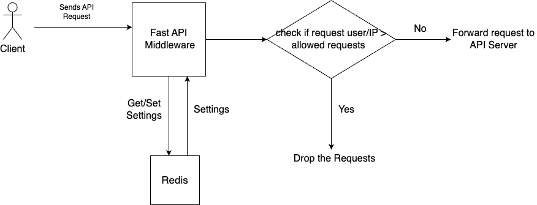

# RateLimiter Project

## Description
ThrottleBox is a lightweight API rate-limiting service built using FastAPI, Redis, and Uvicorn, designed to control request traffic on a per-user or per-IP basis. It implements a Fixed Window algorithm to track and enforce rate limits efficiently.

## Tech Stack Used
FastAPI – For building high-performance, async API endpoints

Redis – Acts as a fast, in-memory data store for request counters and user-specific limit configurations

Uvicorn (ASGI server) – Runs the FastAPI app with async capabilities

## Core Features

### Fixed Window Rate Limiting:
Tracks requests per user/IP in Redis using a key like rate:<ip>. Limits are enforced using TTLs and counters.

### Dynamic Configuration via Admin API:
Admin endpoints (GET/POST /config/{user_id}) allow runtime configuration of rate limits, stored in Redis (config:<user_id>).
There is also a Dashboard api /dashboard to provide a UI for configuring the limits.

### Defaults + Overrides:
If no custom config exists, a default rate limit (e.g., 10 req/min) is applied automatically.

### Request Flow

### Run the project
 1. Create a virtual environment named 'venv'
python3 -m venv venv

 2. Activate the virtual environment
source venv/bin/activate

 3. Install dependencies from requirements.txt
pip install -r requirements.txt

 4. Start the Uvicorn server
uvicorn main:app --reload

 5. Redis Commands

    Connect to redis cli 
        redis-cli -h localhost -p 6379 -a sudha

    Get all keys
        KEYS *

        1) "config:66.68.36.199"
        2) "config:192.168.1.100"
        3) "config:redis-cli"

    Read Key's Values
        HGETALL key

         HGETALL config:192.168.1.100
        1) "limit"
        2) "15"
        3) "window"
        4) "120"

    Set or Update Key
        HMSET config:192.168.1.100 limit 20 window 60

    Check TTL
        TTL config:192.168.1.10

    Delete Key
        DEL config:192.168.1.10

 6. Curl commands
    Used to check POST user config

    curl -X POST http://localhost:8000/config/192.168.1.100 \
    -H "Content-Type: application/json" \
    -d '{"limit": 15, "window": 120}'

 7. Project Learnings

    a) Learn Redis usage and commands
    b) Learned difference between FastAPI and Flask and when to what
    c) Learned about the web servers Uvicorn
    d) Learned the rate limiter algorithm.
    e) Learned and used Jinja2 dashboard.

### Next Steps

Add more rate limiting algorithms like token bucket, leaky bucket etc.

### References 

[1] : https://www.geeksforgeeks.org/rate-limiting-algorithms-system-design/
[2] : https://www.youtube.com/watch?v=fmT5nlEkl3U

